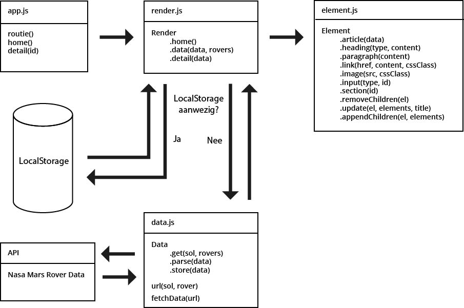

# Web app from scratch

This repo contains a web app built from scratch. It fetches data and images from the [mars rover photos api](https://api.nasa.gov/api.html#MarsPhotos).
You can view the web-app [here](https://jeroenvanberkum.nl/web-app-from-scratch-18-19/).

## Table of contents
* [Actor diagram](#actor-diagram)
* [Interaction diagram](#interaction-diagram)
* [Installation](#installation)
* [Usage](#usage)
* [What it does](#what-it-does)
* [API](#api)
* [Technical details](#technical-details)
* [Notable things](#notable-things)

## Actor diagram


## Interaction diagram


## Installation
Run the following commands in terminal
```
git clone https://github.com/jeroentvb/web-app-from-scratch-18-19.git
cd web-app-from-scratch-18-19
```
Run a local static file server to view the app, otherwise you will get CORS errors. I used atom-live-server while developing.

## Usage
Open the [index.html](index.html) file in your browser of choice to view the web app.

## What it does
This web app talks with NASA's [Mars Rover Photos API](https://api.nasa.gov/api.html#MarsPhotos). On the client side, it pulls data about the photos (including links to the pictures) from the API and renders them on the page.

### Sol
On Mars, the days aren't the same length as the days on Earth. Because of this, there's a different day counting system on Mars: Sol.  
Images from the Mars Rover can be requested from the API by Earth date, or by Sol. I chose to use Sol, and built an input field to select the Sol date to display all images from.

## API
The application uses the [Mars Rover Photos API](https://api.nasa.gov/api.html#MarsPhotos).

### Endpoints
A request url used by the application would look like the following: https://api.nasa.gov/mars-photos/api/v1/rovers/curiosity/photos?sol=1000&api_key=DEMO_KEY.
In this example `curiosity` would be the name of the rover we are requesting photos for.  
There are 3 rovers that the application can request photos from:
* Curiosity (which died recently)
* Opportunity
* Spirit
sol=1000 would be the number of sol we are requesting photos for.  
key=DEMO_KEY is the api key we are using for the requests. `DEMO_KEY` is a valid key.

### Rate limit
The demo uses the `DEMO_KEY` which has the following rate limit:
* Hourly Limit: 30 requests per IP address per hour
* Daily Limit: 50 requests per IP address per day

For development I requested a developer key which has the following rate limit:
* Hourly Limit: 1,000 requests per hour

I didn't want to expose my developer key to github/the user, so I put the `DEMO_KEY` in [api-key.js](public/js/modules/api-key.js) which I then comitted and ignored so it would be available on github-pages. Meanwhile I replaced the `DEMO_KEY` with my development key on my development pc. Because I ignored [api-key.js](public/js/modules/api-key.js), I wouldn't be able to accidently commit my development key.

## Technical details
All the technical details about this app.

### What is uses
Everything is written from scratch, except the routing. It's handled by [routie](http://projects.jga.me/routie/).

### How it works
On page load it sends 3 requests (one for each Mars Rover) using `fetch`, to get the data for all 3 Rovers for sol 1. It then parses the data and renders it on the page using template literals. Every picutre is rendered within an `<article>`.  
It also adds an event listener to the input field on the top of the page. If a different sol is selected it does the above again for the selected sol.  
If there is no data for a rover for the selected sol it displays that there were no pictures taken by the rover for the selected sol.

## Notable things
I wrote the render/template engine myself. It consists of [render.js](public/js/modules/render.js) and [element.js](public/js/modules/element.js). Render.js tells element.js to create the elements. It does this by using `document.createElement()`, after which the elements are passed back to render.js who places the new elements in the DOM.
